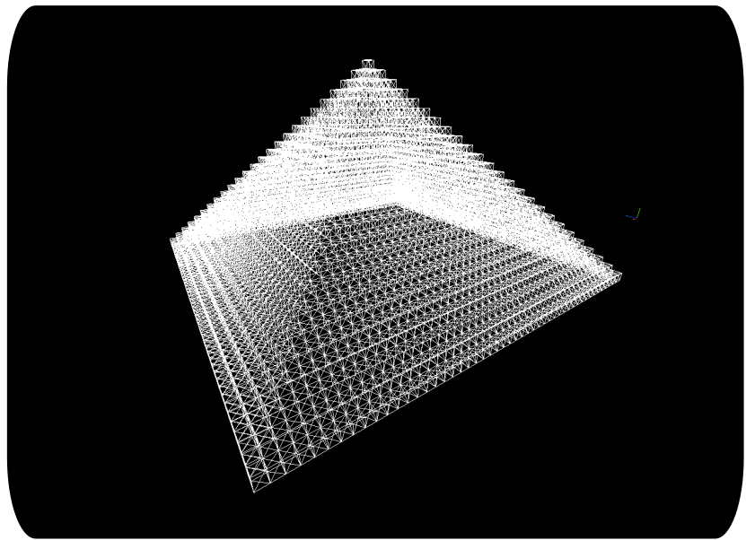

### Pyramid

Experiment project to write algorithem that generate 3D pyramid by a given prime number,

Using threads and SIMD instrincs to calculate the pyrmaid vertices, normals, and uvs really fast.

The result look like the image below:

